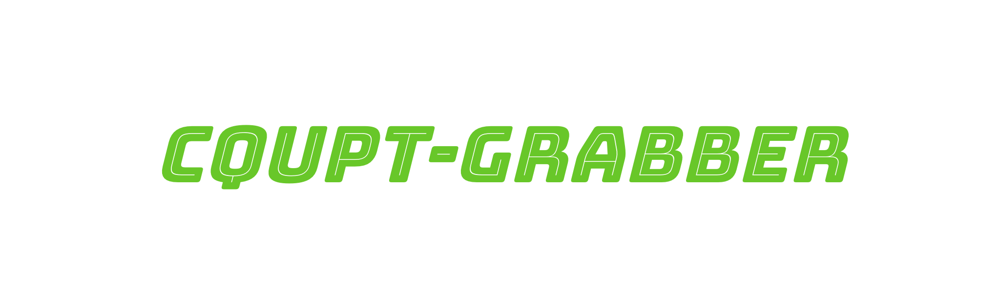

## 目录
- [cqupt-grabber](#cqupt-grabber)
    - [目录](#目录)
    - [特别声明](#特别声明)
    - [安装](#安装)
    - [快速开始](#快速开始)
    - [其余功能](#其余功能)
    - [其他](#其他)

## 特别声明

- 本仓库发布的脚本及其中涉及的任何功能，仅用于测试和学习研究，禁止用于商业用途，禁止用于违法用途，不能保证其准确性，完整性和有效性，请根据情况自行判断。

- 本项目内所有资源文件，禁止任何公众号、自媒体进行任何形式的转载、发布。

- 本人对任何脚本问题概不负责，包括但不限于由任何脚本错误导致的任何损失或损害。

- 请勿将本仓库的任何内容用于商业或非法目的，否则后果自负。

- 如果任何单位或个人认为该项目的脚本可能涉嫌侵犯其权利，则应及时通知并提供身份证明，所有权证明，我将在收到认证文件后删除相关脚本。

- 任何以任何方式查看此项目的人或直接或间接使用该项目的任何脚本的使用者都应仔细阅读此声明。本人保留随时更改或补充此免责声明的权利。一旦使用并复制了任何相关脚本或Go项目的代码，则视为您已接受此免责声明。

**您必须在下载后的24小时内从计算机或手机中完全删除以上内容**

> ***您使用或者复制了本仓库的脚本，则视为 `已接受` 此声明，请仔细阅读***

## 安装

1. 你需要 Go 的开发环境 [Go](https://golang.org/) ，然后您可以使用以下 Go 命令安装抢课工具
```sh
$ go get -u github.com/LgoLgo/cqupt-grabber
```

2. 在你的代码中 import

```go
import "github.com/LgoLgo/cqupt-grabber"
```

## 快速开始
使用包中的 LoopRob ， 0.25s 进行一次抢课，直到有一门课被抢到
```go
package main

import "github.com/LgoLgo/cqupt-grabber/cqupt"

func main() {
  tool := cqupt.New()

  cookie := "这里是一个cookie"

  //支持同时抢多门课程
  loads := []string{
    "这里是第一节课",
    "这里是第二节课"}

  tool.Grabber.LoopRob(cookie, loads)
}
```

> 为防止工具滥用的可能性， cookie 以及 load 需要自己获取

## 其余功能

```go
// 获得所有人文选修课 loads
func AllRenWen(cookie string) {
...
}
```

```go
// 获得所有自然选修课 loads
func AllZiRan(cookie string) {
...
}
```

```go
// 获取所有外语选修课 loads
func AllForeign(cookie string) {
...
}
```

```go
// 搜索课程 load , param 中传入 Rw （人文）或 Zr （自然）
// content 为模糊搜索内容例如输入“工程”会将所有带有工程两个字的课程信息以及负载输出
func Search(param string, cookie string, content string) {
...
}
```

```go
// 简易搜索, 传入关键字切片, 返回 loads, 可直接作为loads传入抢课方法中. 
func (q *Queryer) SimpleSearch(cookie string, content []string) (loads []string) {
...
}
```

```go
// 高并发抢课 会有被 BAN 风险，**不推荐**使用
func LoopRobWithHighConcurrency(cookie string, loads []string) {
...
}
```

```go
// 只进行一次访问并传回响应
func SingleRobWithInfo(cookie string, load string) {
...
}
```

```go
// 自定义一次访问的速度
// duration 中为你想自定义的秒数，建议不小于0.2
func LoopRobWithCustomTime(cookie string, loads []string, duration float64) {
...
}
```

## 其他
若还有其他疑问请提交 issue ，若想参与开发或有任何 BUG 欢迎提交 PR 。

## 许可证
此项目开源在 Apache License 2.0 下。有关完整的许可证文本，请参阅许可证文件。